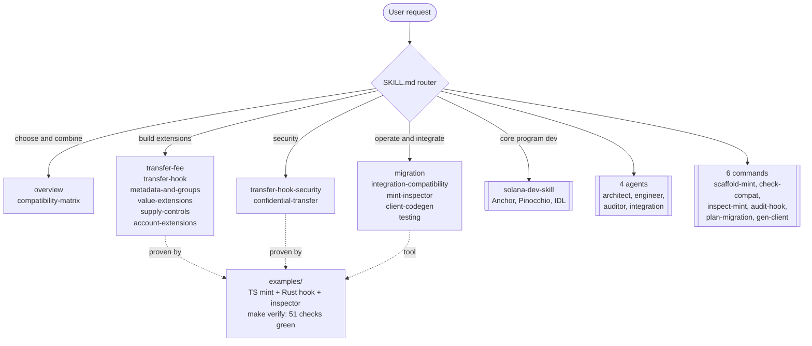

# Solana Token-2022 (Token Extensions) Skill


A progressively loaded Claude Code and Codex skill that makes a coding agent an expert in **SPL Token-2022 (Token Extensions)**: choosing and combining extensions, building mints and transfer hooks, migrating from SPL Token, integrating with wallets and DEXs, and auditing transfer-hook security. It is built to slot into the [Solana AI Kit](https://github.com/solanabr/solana-ai-kit) next to `solana-dev-skill`, which it delegates core program work to instead of duplicating it.

Token-2022 is the 2026 standard for serious tokens (stablecoins, real-world assets, regulated tokens), and its extension surface is where builders trip: init ordering, account sizing, incompatible pairs, and transfer-hook security. No existing kit skill consolidates this. This one does, and ships tested reference code to prove it.

## How the skill routes (progressive loading)



The agent reads `SKILL.md` first, then loads only the focused file a task needs. Tokens are spent on the topic at hand, not the whole skill.

## Why this skill

- **Useful**: covers the full Token-2022 extension surface that builders hit every day, with the init-order and account-sizing gotchas that cause silent failures, plus a use-case decision tree from requirement to extension set. It ships a read-only **mint inspector** (CLI and MCP) that decodes any mint and flags wallet, DEX, and CEX risks, and a second MCP tool, `check_extension_compatibility`, that vets a planned extension set before any code exists.
- **Novel**: material nobody else ships as a skill: an **extension compatibility matrix** (including the runtime-enforced Scaled UI Amount versus Interest-Bearing exclusion and the required-companion rules), a **transfer-hook security audit checklist**, and an accurate **confidential-transfer status** (disabled on mainnet since June 2025, re-enabled on testnet and devnet only, tracking issue [token-2022#657](https://github.com/solana-program/token-2022/issues/657), still open). The matrix and integration rules are executable: the inspector turns them into a risk engine, and it names extension codes the published `@solana/spl-token` enum does not yet map (such as the confidential transfer fee on PYUSD), so a real mint decodes completely instead of showing "unrecognized".
- **Tested**: three reference builds run offline and deterministic, 51 checks total. A TypeScript multi-extension mint on LiteSVM (7 tests plus a transfer-hook end-to-end scenario), a native Rust transfer-hook program (`cargo build-sbf` plus 8 unit tests), and the mint inspector (35 tests, including offline decodes of five captured mainnet mints: PYUSD, USDC, BERN, sUSD, and a WNS hooked NFT). Two inaccuracies were caught and corrected by running the code against PYUSD: a confidential-transfer-with-hook pair wrongly flagged as incompatible (PYUSD carries both), and an extension code the inspector now names instead of dropping.
- **Fits**: mirrors the reference skill shape (skill router, focused docs, agents, commands, rules, installer), so it can be submoduled into the kit. The inspector exposes two MCP tools, `inspect_mint` and `check_extension_compatibility`, that an agent can call directly.

## What's included

### Token-2022 knowledge (this addon)

Decide and combine: `overview.md`, `compatibility-matrix.md`.
Extension families: `transfer-fee.md`, `transfer-hook.md`, `metadata-and-groups.md`, `value-extensions.md`, `supply-controls.md`, `account-extensions.md`.
Operate and integrate: `migration.md`, `integration-compatibility.md`, `mint-inspector.md`, `client-codegen.md`, `testing.md`.
Security: `transfer-hook-security.md`, `confidential-transfer.md`.
Reference: `resources.md`.

### Tools

`mint-inspector.md` documents a read-only inspector that decodes a live mint's extensions and reports its wallet, DEX, and CEX integration risks. It ships as a CLI and two MCP tools in `examples/mint-inspector`: `inspect_mint` (decode and assess a live mint) and `check_extension_compatibility` (vet a planned extension set before any mint exists), with offline tests.

### Core (delegated to solana-dev-skill)

Program development (Anchor, Pinocchio), IDL and client codegen, base testing harness, and the base security checklist come from `solana-dev-skill`. This skill links to them and never duplicates them.

## Install

The installer copies `skill/*` into `~/.claude/skills/solana-token-extensions/`. By default it also registers the four agents into `~/.claude/agents/` and the six commands into `~/.claude/commands/`, so they work standalone as live subagents and slash commands. It does **not** modify your global `~/.claude/CLAUDE.md`, and it never overwrites an existing agent or command (a same-named file is skipped with a notice).

```bash
# Standard: skill plus agents and commands
./install.sh -y

# Skill only, no agents or commands
./install.sh -y --skill-only

# Interactive: choose the skills directory and what to register
./install-custom.sh
```

Repo-relative links inside the copied agents and commands are rewritten to the installed absolute paths, so they resolve outside the repo. If `solana-dev-skill` is not already installed, the installer offers to clone it (this skill delegates core program work to it).

## Default stack (January 2026)

- Program: `spl-token-2022`, accessed through anchor-spl `token_interface` so code serves both SPL Token and Token-2022 mints.
- Client: `@solana/kit` for transactions and codecs, `@solana/spl-token` for extension instruction builders.
- Tests: LiteSVM for offline extension behavior, run one file per process by the test runner (the native addon is stable that way). `solana-bankrun` is deprecated and not used.
- Confidential transfers: disabled on mainnet since June 2025, still disabled as of June 2026 (re-enabled on testnet and devnet only, issue #657). Not presented as production ready.

## Tested reference code

All three examples run offline with no validator and no devnet.

```bash
cd examples
make verify     # builds the Rust hook, then runs the TS, inspector, and Rust suites
```

What passes (51 checks):

- `examples/ts-multi-extension-mint`: builds one mint combining transfer fee, metadata pointer, token metadata, and interest-bearing, then asserts the four extensions are present, the fee is withheld on receive and withdrawable, and the metadata reads back. Further tests assert that an out-of-order initialization is rejected and that the fee is capped and floored correctly. **7 tests, LiteSVM, offline.**
- `examples/transfer-hook-allowlist`: a native Rust transfer hook with a fail-closed allowlist, the transferring-flag gate, per-destination PDA validation, and an `AddToAllowlist` instruction gated on the mint authority. `cargo build-sbf` produces a deployable program and `cargo test` runs **8 unit tests**.
- End to end: `integration/transfer-hook-e2e.ts` loads the compiled hook, creates a Token-2022 mint that uses it, and proves a real transfer is **blocked** when the destination is not allowlisted and **allowed** after `AddToAllowlist`. It runs under tsx (`npm run e2e`): LiteSVM's native addon is stable in a plain process but aborts intermittently inside a vitest worker, so this BPF-executing scenario runs outside vitest.
- `examples/mint-inspector`: the read-only mint inspector (CLI and two MCP tools). The risk engine is tested as pure functions, the decoder against Token-2022 mints built in LiteSVM and against five captured mainnet mints (PYUSD, USDC, BERN, sUSD, and a WNS hooked NFT) decoded offline, and the MCP handler with an injected fetcher. **35 tests, offline.** See [examples/mint-inspector/README.md](examples/mint-inspector/README.md).

A captured run is committed at `examples/VERIFICATION_OUTPUT.txt`.

## Verified facts (checked June 2026)

| Component | Pinned | Source |
|---|---|---|
| `@solana/spl-token` | 0.4.14 | npmjs.com/package/@solana/spl-token |
| `@solana/spl-token-metadata` | 0.1.6 | npm |
| `@solana/web3.js` | 1.98.4 | npm |
| `litesvm` (JS) | 0.6.x | npmjs.com/package/litesvm (1.x moved to @solana/kit Address types; pinned to the web3.js 1.x line) |
| `spl-token-2022` (Rust) | 11.0.0 | docs.rs/spl-token-2022 |
| `spl-transfer-hook-interface` | 2.1.0 | docs.rs/spl-transfer-hook-interface |
| `spl-tlv-account-resolution` | 0.11.1 | docs.rs/spl-tlv-account-resolution |
| Toolchain | solana-cli 3.1.9, cargo-build-sbf 3.1.9, Node 22 | local |
| Confidential transfers | disabled on mainnet since June 2025 | github.com/solana-program/token-2022/issues/657 |

## Agents

| Agent | Purpose |
|---|---|
| `token-architect` | Extension selection, token model, compatibility and init order |
| `extensions-engineer` | Mint and transfer-hook implementation, client wiring |
| `token-2022-auditor` | Hook and config security review, ExtraAccountMetaList and CPI checks |
| `integration-engineer` | Wallet, DEX, and CEX compatibility, migration execution |

## Commands

| Command | Description |
|---|---|
| `/scaffold-mint` | Scaffold a Token-2022 mint with a chosen extension set, sized and ordered |
| `/check-extension-compatibility` | Validate an extension set against the compatibility matrix |
| `/inspect-mint` | Decode a live mint by address and report wallet, DEX, and CEX integration risks |
| `/audit-transfer-hook` | Security review of a transfer-hook program and its ExtraAccountMetaList |
| `/plan-migration` | Plan an SPL Token to Token-2022 migration |
| `/generate-client` | Generate TypeScript and Rust client code for a mint's extensions |

## Repository structure

```
solana-token-extensions-skill/
├── skill/                     SKILL.md router + 16 focused docs (+ solana-dev-skill submodule)
├── agents/                    4 specialized agents
├── commands/                  6 workflow commands
├── rules/                     rust.md, typescript.md (code style law)
├── examples/
│   ├── ts-multi-extension-mint/    TypeScript mint + LiteSVM tests + e2e integration script
│   ├── transfer-hook-allowlist/    native Rust hook + unit tests
│   ├── mint-inspector/             read-only mint inspector (CLI + 2 MCP tools) + offline tests
│   ├── Makefile                    make verify
│   └── VERIFICATION_OUTPUT.txt     committed run transcript
├── CLAUDE.md                  skill agent configuration
├── install.sh / install-custom.sh
└── LICENSE                    MIT
```

This repo vendors `solana-dev-skill` as a git submodule under `skill/solana-dev-skill` (the delegated core docs), matching the reference layout. Clone with `git clone --recurse-submodules`, or run `git submodule update --init` after a plain clone.

## Add to the Solana AI Kit (optional)

To wire this skill into a local `solana-ai-kit` checkout the same way the other skills are registered:

```bash
git submodule add https://github.com/Andy00L/solana-token-extensions-skill \
  .claude/skills/ext/solana-token-extensions
```

Then add one routing line for it in the kit's hub `.claude/skills/SKILL.md` (and, optionally, a catalog entry in `.claude/skills/skill-registry.json`). See [KIT_INTEGRATION.md](KIT_INTEGRATION.md) for the exact hub line, the optional registry entry, and the fork-and-PR steps.

## Contributing

Issues and pull requests are welcome. Keep the standards the repo already follows: focused, token-efficient docs that cite a primary source for any non-obvious claim, errors as values with no type suppression in code, and tests that run offline.

## License

MIT. See [LICENSE](LICENSE).
