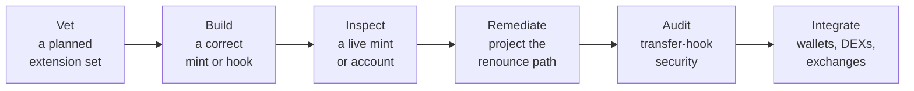
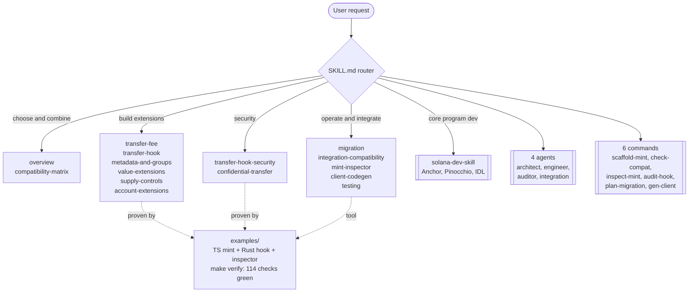

# 🪙 Solana Token-2022 (Token Extensions) Skill


[](https://github.com/Andy00L/solana-token-extensions-skill/actions/workflows/verify.yml)


> **Choose, build, integrate, and audit SPL Token-2022 mints from one toolset, with tested reference code and a read-only mint inspector an AI agent can call directly.**

A progressively loaded skill for Claude Code and Codex that makes a coding agent an expert in **SPL Token-2022 (Token Extensions)**: choosing and combining extensions, building mints and transfer hooks, migrating from SPL Token, integrating with wallets and DEXs, and auditing transfer-hook security. It runs on its own, and also drops into the [Solana AI Kit](https://github.com/solanabr/solana-ai-kit) next to `solana-dev-skill`, to which it delegates core program work instead of duplicating it.

Token-2022 is the 2026 standard for serious tokens (stablecoins, real-world assets, regulated tokens), and its extension surface is where builders trip: init ordering, account sizing, incompatible pairs, and transfer-hook security. Most material on it is scattered or docs-only. This skill consolidates the full surface and ships tested reference code to back every claim.

The mint inspector decoding PayPal USD (PYUSD): a CRITICAL verdict driven by the live permanent delegate, with conditional severity, a 0-to-100 risk score, a per-finding fix, and the confidential transfer fee that the published `@solana/spl-token` enum does not name.


## 🛠️ What it does

It spans the whole lifecycle, from a requirement to a token an exchange can list:



- **Vet** a planned extension set for runtime-rejected pairs and integration risk before any code exists.
- **Build** a correctly ordered, correctly sized mint, and a transfer-hook client with its extra accounts resolved.
- **Inspect** any live mint or token account, with a 0-to-100 risk score, a verdict tier, and a concrete fix per finding.
- **Remediate** by recomputing the verdict for each authority an issuer could renounce, so the score becomes a path, not just a label.
- **Audit** transfer-hook security against a checklist, backed by a hardened reference hook.
- **Integrate** with a wallet, DEX, and exchange posture for any mint, plus an SPL-to-Token-2022 migration plan.

Six of these are agent-callable without writing code: a CLI plus five read-only MCP tools (`inspect_mint`, `inspect_many`, `check_extension_compatibility`, `scaffold_mint`, `generate_hook_transfer`), each with a structured, agent-consumable verdict.

## 🧭 How the skill routes (progressive loading)



The agent reads `SKILL.md` first, then loads only the focused file a task needs. Tokens are spent on the topic at hand, not the whole skill.

## ✨ What sets it apart

- **A read-only mint inspector**, as a CLI and five MCP tools, that decodes any mint or token account and reports wallet, DEX, and exchange risk with a 0-to-100 score, a verdict tier, and a fix per finding. `inspect_mint` reports one mint plus a renounce-to-remediate path, `inspect_many` triages a whole listing set in one call, `check_extension_compatibility` vets a planned set before any code exists, `scaffold_mint` generates a correct mint from a legal set (refusing any set the runtime would reject at init), and `generate_hook_transfer` emits a transfer client for a hooked mint with its extra accounts resolved against the Execute account set.
- **Corrections most references get wrong**, each verified against a primary source: confidential transfers are **re-enabled on mainnet** (2026-06-04, read from the on-chain `reenable_zk_elgamal_proof_program` gate); the runtime-enforced incompatible pairs (such as Scaled UI Amount with Interest-Bearing) and the required-companion rules; and every extension code 0 to 28 is named, including codes the published `@solana/spl-token` enum omits (so PYUSD decodes completely instead of showing "unrecognized").
- **An executable risk engine**, not just prose. It scores a fund-loss-grade extension high only while its controlling authority is live (the live-versus-renounced model Jupiter uses to gate transfer-fee tokens and Neodyme prescribes for hooks), weighs a transfer fee by size to flag a near-100% fee as a sell-blocking honeypot even when the rate is locked, resolves the active versus a scheduled fee under the two-epoch rule, and turns a verdict into a remediation path (CRITICAL today to MEDIUM once the permanent delegate is renounced).
- **Build, not only audit.** `scaffold_mint` turns a legal extension set into correct, correctly-ordered, correctly-sized mint code and refuses any set the runtime would reject at init; the transfer-hook codegen resolves the extra accounts against the Execute account set, the fix for the most common hook-integration bug.
- **Proven by running it.** Two real inaccuracies were caught and corrected by running the inspector against PYUSD: a confidential-transfer-with-hook pair wrongly flagged as incompatible (PYUSD carries both), and an extension code the inspector now names instead of dropping.

## 🧪 Tested reference code

Three reference builds run offline and deterministically, no validator and no devnet, for **114 checks total**, plus a CI-gated live mainnet smoke test.

```bash
cd examples
make verify     # builds the Rust hook, then runs the TS, inspector, and Rust suites
make evals      # runs the mint inspector's scored eval suite on its own
```

- `examples/ts-multi-extension-mint`: builds one mint combining transfer fee, metadata pointer, token metadata, and interest-bearing, then asserts the extensions are present, the fee is withheld on receive and withdrawable, the metadata reads back, an out-of-order initialization is rejected, and the fee is capped and floored correctly. **7 tests, LiteSVM, offline.**
- `examples/transfer-hook-allowlist`: a native Rust transfer hook with a fail-closed allowlist, the transferring-flag gate, mint and account-linkage validation, a per-(mint, destination) allow PDA, and an `AddToAllowlist` instruction gated on the mint authority (the mint is verified as Token-2022-owned before its authority is trusted). `cargo build-sbf` produces a deployable program and `cargo test` runs **22 unit tests**, including adversarial cases: a non-authority signer, a renounced mint authority, a forged (non-Token-2022) mint, an unexpected allow PDA, a mint-sized account passed where a token account is expected, instruction-discriminator non-collision, and account-count boundaries.
- End to end: `integration/transfer-hook-e2e.ts` loads the compiled hook, creates a Token-2022 mint that uses it, and proves a real transfer is **blocked** when the destination is not allowlisted and **allowed** after `AddToAllowlist`. It runs under tsx (`npm run e2e`) because LiteSVM's native addon is stable in a plain process but aborts intermittently inside a vitest worker.
- `examples/mint-inspector`: the read-only inspector (CLI and five MCP tools). The risk engine, the remediation projection, the batch triage, the compatibility checker, the scaffold generator, and the hook codegen are tested as pure functions; the decoder against Token-2022 mints built in LiteSVM, against five captured mainnet mints (PYUSD, USDC, BERN, sUSD, and a WNS hooked NFT) decoded offline, and against a built token account; and the MCP handlers with an injected fetcher. A **16-case scored eval suite** (`npm run evals`) runs the executable scenarios through the real engine and fails the build on any verdict regression. **84 tests, offline.** See [examples/mint-inspector/README.md](examples/mint-inspector/README.md).

A captured run is committed at [examples/VERIFICATION_OUTPUT.txt](examples/VERIFICATION_OUTPUT.txt), and [THREAT_MODEL.md](THREAT_MODEL.md) maps each adversarial test to the threat it closes. Representative prompts with the expected routing and assertions are in [EVALS.md](EVALS.md). A GitHub Actions workflow (`.github/workflows/verify.yml`) runs the suites on every push, plus a best-effort live mainnet smoke test and the on-chain transfer-hook end-to-end scenario.

## 📊 How it compares

Token-2022 tooling tends to take one of three shapes: a docs-plus-hook skill, a mints-only risk auditor, or a build-only skill. This project spans all three. The columns below contrast the typical shape of each with what this skill provides.

| Capability | This skill | Typical docs + hook skill | Typical mint auditor | Typical build skill |
|---|---|---|---|---|
| Agent-callable MCP tools | 5 (`inspect_mint`, `inspect_many`, `check_extension_compatibility`, `scaffold_mint`, `generate_hook_transfer`) | none | none | none |
| Decode and risk-score a live mint | yes (mints and token accounts) | no | yes (mints only) | no |
| Conditional severity (live vs renounced authority) | yes | no | yes | no |
| Risk score plus per-finding fix | yes (0-to-100 plus fix) | no | yes (tiered plus fix templates) | no |
| Renounce-to-remediate projection (recomputed verdict) | yes | no | no (static templates) | no |
| Batch / portfolio triage in one call | yes (`inspect_many`) | no | no | no |
| Token-account inspection | yes | no | no | no |
| Value-aware fee (near-100% honeypot, scheduled jump) | yes | no | no | no |
| Build-time mint scaffold with guardrails | yes (`scaffold_mint`, refuses illegal sets) | no | no | no |
| Transfer-hook integration codegen | yes (`--hook-codegen`, Execute-set resolution) | no | no | no |
| Tested Rust transfer hook plus builder (`cargo build-sbf`) | yes (22 unit tests, hardened) | hook only | no | no |
| Full build plus integrate plus migrate surface | yes | partial (docs) | no (audit-only) | partial (build docs) |
| Offline deterministic suite | 114 checks plus a 16-case scored eval suite plus CI live smoke | hook tests | audit lib plus CI | none |

A focused mint auditor covers the audit axis well (conditional severity, scoring, fix templates). This skill matches that core and adds agent-callable MCP tools, batch triage, the recomputed remediation projection, a value-aware transfer-fee engine, token-account inspection, a guardrailed scaffold generator, and a tested Rust transfer hook, so it spans the whole build-and-integrate surface rather than one slice of it.

## 📦 What's included

### Token-2022 knowledge

Decide and combine: `overview.md`, `compatibility-matrix.md`.
Extension families: `transfer-fee.md`, `transfer-hook.md`, `metadata-and-groups.md`, `value-extensions.md`, `supply-controls.md`, `account-extensions.md`.
Operate and integrate: `migration.md`, `integration-compatibility.md`, `mint-inspector.md`, `client-codegen.md`, `testing.md`.
Security: `transfer-hook-security.md`, `confidential-transfer.md`.
Reference: `resources.md`.

### Tools

`mint-inspector.md` documents the read-only inspector that decodes a live mint's extensions and reports its wallet, DEX, and exchange integration risks. It ships as a CLI and five MCP tools in `examples/mint-inspector`: `inspect_mint` (decode and assess one live mint, with a renounce-to-remediate path), `inspect_many` (triage a list of mints in one call with per-mint verdicts and an aggregate), `check_extension_compatibility` (vet a planned extension set before any mint exists), `scaffold_mint` (generate a correct, correctly-ordered, correctly-sized mint from a legal extension set, refusing any set the runtime would reject at init), and `generate_hook_transfer` (emit a correct transfer client for a hooked mint, extra accounts resolved against the Execute set), with offline tests.

### Core (delegated to solana-dev-skill)

Program development (Anchor, Pinocchio), IDL and client codegen, the base testing harness, and the base security checklist come from `solana-dev-skill`. This skill links to them and never duplicates them.

## ⚙️ Install

The installer copies `skill/*` into `~/.claude/skills/solana-token-extensions/`. By default it also registers the four agents into `~/.claude/agents/` and the six commands into `~/.claude/commands/`, so they work standalone as live subagents and slash commands. It does **not** modify your global `~/.claude/CLAUDE.md`, and it never overwrites an existing agent or command (a same-named file is skipped with a notice).

```bash
# Standard: skill plus agents and commands
./install.sh -y

# Skill only, no agents or commands
./install.sh -y --skill-only

# Interactive: choose the skills directory and what to register
./install-custom.sh
```

Repo-relative links inside the copied agents and commands are rewritten to the installed absolute paths, so they resolve outside the repo. If `solana-dev-skill` is not already installed, the installer offers to clone it (this skill delegates core program work to it).

## 🧱 Default stack (January 2026)

- Program: `spl-token-2022`, accessed through anchor-spl `token_interface` so code serves both SPL Token and Token-2022 mints.
- Client: `@solana/kit` for transactions and codecs, `@solana/spl-token` for extension instruction builders. The split is deliberate: new client code in the docs uses `@solana/kit`, while the tested inspector stays on `@solana/spl-token` because its typed mint and account unpack helpers and `ExtensionType` codecs are the maintained source of truth for decoding a live mint (the `@solana/kit` line does not yet expose equivalents), so decoding is verified against the program's own getters rather than reimplemented.
- Tests: LiteSVM for offline extension behavior, run one file per process by the test runner (the native addon is stable that way). `solana-bankrun` is deprecated and not used.
- Confidential transfers: re-enabled on mainnet on 2026-06-04 (the `reenable_zk_elgamal_proof_program` feature gate is active and the ZK ElGamal Proof Program is executable again), ending the disablement that ran from 2025-06-19 (issue #657). Treated as live but handled with care: narrow wallet, DEX, and exchange support, and a compliance review for opaque balances.

## 🔎 Verified facts (checked June 2026)

| Component | Pinned | Source |
|---|---|---|
| `@solana/spl-token` | 0.4.14 | npmjs.com/package/@solana/spl-token |
| `@solana/spl-token-metadata` | 0.1.6 | npm |
| `@solana/web3.js` | 1.98.4 | npm |
| `litesvm` (JS) | 0.6.x | npmjs.com/package/litesvm (1.x moved to @solana/kit Address types; pinned to the web3.js 1.x line) |
| `spl-token-2022` (Rust) | 11.0.0 | docs.rs/spl-token-2022 |
| `spl-token-2022-interface` (Rust) | 3.1.0 (ExtensionType codes 0 to 28) | docs.rs/spl-token-2022-interface |
| `spl-transfer-hook-interface` | 2.1.0 | docs.rs/spl-transfer-hook-interface |
| `spl-tlv-account-resolution` | 0.11.1 | docs.rs/spl-tlv-account-resolution |
| Toolchain | solana-cli 3.1.9, cargo-build-sbf 3.1.9, Node 22 | local |
| Confidential transfers | re-enabled on mainnet 2026-06-04 (`reenable_zk_elgamal_proof_program` gate active, proof program executable); disabled 2025-06-19 to 2026-06-04 | on-chain feature gates; github.com/solana-program/token-2022/issues/657 |

## 🤖 Agents

| Agent | Purpose |
|---|---|
| `token-architect` | Extension selection, token model, compatibility and init order |
| `extensions-engineer` | Mint and transfer-hook implementation, client wiring |
| `token-2022-auditor` | Hook and config security review, ExtraAccountMetaList and CPI checks |
| `integration-engineer` | Wallet, DEX, and exchange compatibility, migration execution |

## ⌨️ Commands

| Command | Description |
|---|---|
| `/scaffold-mint` | Scaffold a Token-2022 mint with a chosen extension set, sized and ordered |
| `/check-extension-compatibility` | Validate an extension set against the compatibility matrix |
| `/inspect-mint` | Decode a live mint by address and report wallet, DEX, and exchange integration risks |
| `/audit-transfer-hook` | Security review of a transfer-hook program and its ExtraAccountMetaList |
| `/plan-migration` | Plan an SPL Token to Token-2022 migration |
| `/generate-client` | Generate TypeScript and Rust client code for a mint's extensions |

## 🗂️ Repository structure

```
solana-token-extensions-skill/
├── skill/                     SKILL.md router + 16 focused docs (+ solana-dev-skill submodule)
├── agents/                    4 specialized agents
├── commands/                  6 workflow commands
├── rules/                     rust.md, typescript.md (code style law)
├── examples/
│   ├── ts-multi-extension-mint/    TypeScript mint + LiteSVM tests + e2e integration script
│   ├── transfer-hook-allowlist/    native Rust hook + unit tests
│   ├── mint-inspector/             read-only mint inspector (CLI + 5 MCP tools) + offline tests
│   ├── Makefile                    make verify, make evals, make demo
│   └── VERIFICATION_OUTPUT.txt     committed run transcript
├── CLAUDE.md                  skill agent configuration
├── install.sh / install-custom.sh
└── LICENSE                    MIT
```

This repo vendors `solana-dev-skill` as a git submodule under `skill/solana-dev-skill` (the delegated core docs), matching the reference layout. Clone with `git clone --recurse-submodules`, or run `git submodule update --init` after a plain clone.

## 🔌 Add to the Solana AI Kit (optional)

To wire this skill into a local `solana-ai-kit` checkout the same way the other skills are registered:

```bash
git submodule add https://github.com/Andy00L/solana-token-extensions-skill \
  .claude/skills/ext/solana-token-extensions
```

Then add one routing line for it in the kit's hub `.claude/skills/SKILL.md` (and, optionally, a catalog entry in `.claude/skills/skill-registry.json`). See [KIT_INTEGRATION.md](KIT_INTEGRATION.md) for the exact hub line, the optional registry entry, and the fork-and-PR steps.

## 🤝 Contributing

Issues and pull requests are welcome. Keep the standards the repo already follows: focused, token-efficient docs that cite a primary source for any non-obvious claim, errors as values with no type suppression in code, and tests that run offline.

## 📄 License

MIT. See [LICENSE](LICENSE).
